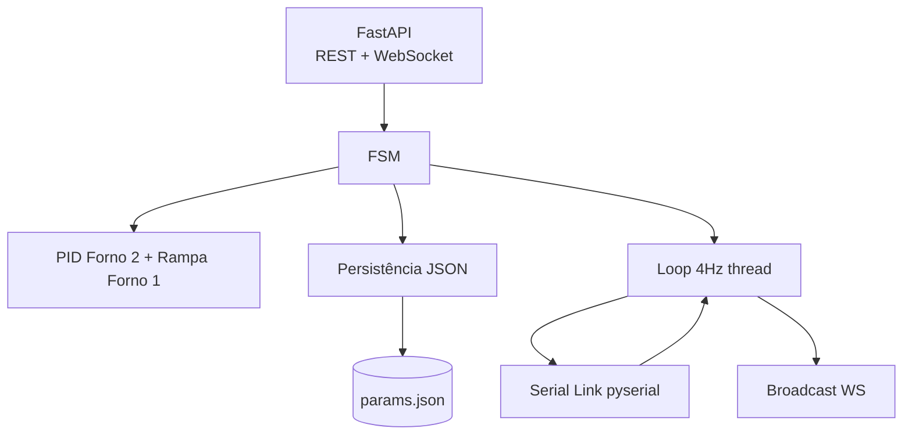

# Backend de Controle (RPi) Design

**Spec**: `.specs/features/backend-controle/spec.md`
**Status**: Draft

---

## Architecture Overview

Aplicação FastAPI com um loop de controle em thread dedicada (4 Hz) que dialoga com a serial e publica telemetria via WebSocket. A FSM orquestra; módulos de PID, rampa e persistência são independentes e testáveis.



---

## Code Reuse Analysis

| Component        | Location         | How to Use                  |
| ---------------- | ---------------- | --------------------------- |
| Contratos JSON   | TDD (docs/TDD.md)| Referência dos payloads     |
| pydantic         | lib externa      | Validação de config/command |
| FastAPI          | lib externa      | REST + WebSocket            |

## Integration Points

| System   | Integration Method                       |
| -------- | ---------------------------------------- |
| Arduino  | pyserial, JSON @4Hz                      |
| Frontend | HTTP REST + WebSocket `/ws/telemetry`    |
| Disco    | `backend/data/params.json` (atômico)     |

---

## Components

### ConfigStore
- **Purpose**: persistir/ler parâmetros com validação e backup.
- **Location**: `backend/app/config_store.py`
- **Interfaces**:
  - `load() -> Params`
  - `save(Params) -> None` (atômico + backup rotativo)
  - `validate(Params) -> None` (raise em faixa inválida)
- **Dependencies**: pydantic.
- **Reuses**: modelo persistido do TDD.

### PidController
- **Purpose**: PID genérico (proporcional-integral com anti-windup simples).
- **Location**: `backend/app/pid.py`
- **Interfaces**:
  - `update(setpoint, pv, dt) -> float` (0–255)
  - `reset()`
- **Dependencies**: nenhum.
- **Reuses**: TDD "PID misto".

### RampController
- **Purpose**: calcular VM do Tubo U (razão de taxas abaixo de 0 °C, PID acima).
- **Location**: `backend/app/ramp.py`
- **Interfaces**:
  - `compute(t_current, dt) -> float`
  - `heating_rate_c_per_s() -> float`
- **Dependencies**: PidController, ConfigStore.

### SerialLink
- **Purpose**: enlace pyserial com codec JSON e reconexão.
- **Location**: `backend/app/serial_link.py`
- **Interfaces**:
  - `connect()/close()`
  - `write_command(Command)`
  - `read_report() -> Report | None`
- **Dependencies**: pyserial.

### StateMachine
- **Purpose**: FSM com Safe State, ciclo T₀→T₃, Manual e STOP.
- **Location**: `backend/app/fsm.py`
- **Interfaces**:
  - `handle_event(Event)`
  - `tick(dt)` — avança fases e atualiza atuadores.
  - `actuator_state() -> dict` (matriz T₀–T₃).
- **Dependencies**: RampController, PidController, SerialLink.

### ApiServer
- **Purpose**: endpoints REST + WebSocket.
- **Location**: `backend/app/main.py`, `backend/app/api.py`
- **Interfaces**:
  - `GET/PUT /api/config`
  - `POST /api/control/{start,stop,emergency}`
  - `PUT /api/manual`
  - `WS /ws/telemetry`
- **Dependencies**: FastAPI, StateMachine, ConfigStore.

---

## Data Models

### Params (persistido)

```python
class Params(BaseModel):
    version: int = 1
    pid_u: PIDGains
    pid_f2: PIDGains
    times_s: dict  # t1, t2, t3
    ramp: RampConfig  # time_s, nitrogen_temp_c, target_temp_c
    setpoints: dict  # f2_c
```

### Telemetry (WS, 4 Hz)

```json
{
  "ts": 0.0, "temp": {"t1": 0.0, "t2": 0.0},
  "sp": {"u": 0.0, "f2": 0.0}, "pwm": {"u": 0, "f2": 0},
  "rate_c_per_s": 0.0, "state": "SAFE",
  "valves": {}, "pump": 0, "error_code": 0
}
```

---

## Error Handling Strategy

| Error Scenario             | Handling                                | User Impact                     |
| -------------------------- | --------------------------------------- | ------------------------------- |
| Serial indisponível        | Safe State + retry de reconexão         | IHM mostra status "safe"        |
| Parâmetros corrompidos     | Restaura backup; se ausente, defaults   | Alerta na IHM                   |
| Parâmetros fora de faixa   | HTTP 422 com detalhes                   | Operador corrige a entrada      |
| Termopar com erro de leitura | Mantém último valor; sinaliza        | Controle degradado mas seguro   |

---

## Tech Decisions

| Decision                | Choice              | Rationale                                 |
| ----------------------- | ------------------- | ----------------------------------------- |
| Framework web           | FastAPI + uvicorn   | REST + WebSocket em uma lib               |
| Serial                  | pyserial            | Padrão para USB serial no RPi             |
| Loop de controle        | Thread dedicada 4Hz | Isola timing do servidor web              |
| Persistência            | JSON atômico        | Simples, auditável, sem dependência de BD |
