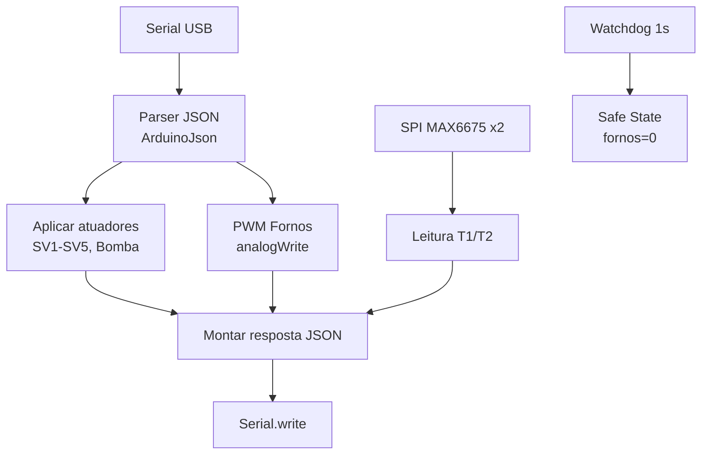

# Firmware DAQ (Arduino) Design

**Spec**: `.specs/features/firmware-daq/spec.md`
**Status**: Draft

---

## Architecture Overview

Loop único não-bloqueante a ~250 ms: lê serial (buffer de linha), faz parse JSON, aplica saídas/PWM, lê termopares, monta e envia resposta, atualiza watchdog.



---

## Code Reuse Analysis

| Component        | Location            | How to Use                          |
| ---------------- | ------------------- | ----------------------------------- |
| ArduinoJson      | lib externa         | Parse + serialização de pacotes     |
| Biblioteca SPI    | lib do core Arduino | Comunicação com os termopares       |
| Biblioteca termopar (MAX6675) | lib externa | Leitura T1/T2 |

## Integration Points

| System   | Integration Method                       |
| -------- | ---------------------------------------- |
| Backend  | Serial USB, JSON @4Hz (contratos do TDD) |
| Fornos   | PWM pinos 9 (Tubo U) e 10 (Forno 2)      |
| Válvulas | Digitais pinos 2–7 (mapa de I/O do TDD)  |

---

## Components

### PinMap
- **Purpose**: centralizar o mapeamento de pinos e o Safe State.
- **Location**: `firmware/src/pin_map.h`
- **Interfaces**:
  - `void initPins()` — configura pinos, estado inicial seguro (tudo em 0).
  - `void safeState()` — desliga fornos e válvulas (SV5 baixo).
- **Dependencies**: nenhum.
- **Reuses**: mapa de I/O do TDD.

### JsonProtocol
- **Purpose**: parsear e serializar os pacotes JSON.
- **Location**: `firmware/src/json_protocol.{h,cpp}`
- **Interfaces**:
  - `bool parseIncoming(const char* buf, Command& cmd)` — parse de `config`/escrita.
  - `void buildReport(const Report& rep, char* buf, size_t cap)` — monta JSON de leitura.
- **Dependencies**: ArduinoJson.
- **Reuses**: contratos JSON do TDD (handshake, escrita, leitura).

### ThermocoupleReader
- **Purpose**: ler T1/T2 via SPI.
- **Location**: `firmware/src/thermocouple_reader.{h,cpp}`
- **Interfaces**:
  - `void begin()` — inicia SPI e CS.
  - `bool readTemps(float& t1, float& t2)` — retorna false se erro de leitura.
- **Dependencies**: SPI + lib do termopar.

### ActuatorDriver
- **Purpose**: aplicar estado das saídas e PWMs.
- **Location**: `firmware/src/actuator_driver.{h,cpp}`
- **Interfaces**:
  - `void apply(const Command& cmd)` — aplica válvulas/bomba/PWM.
- **Dependencies**: PinMap.

### Watchdog
- **Purpose**: desligar fornos se não houver pacote válido em 1 s.
- **Location**: `firmware/src/watchdog.{h,cpp}`
- **Interfaces**:
  - `void feed()` — registra recebimento de pacote válido.
  - `bool tripped()` — true se > 1000 ms sem feed.
- **Dependencies**: temporizador (millis).

---

## Data Models

### Command (entrada)

```cpp
struct Command {
  uint8_t sv1, sv2, sv3, sv4, sv5;
  uint8_t pump;
  uint8_t pwm_u;
  uint8_t pwm_f2;
};
```

### Report (saída)

```cpp
struct Report {
  float t1;
  float t2;
  const char* status;   // "active" | "safe"
  int error_code;
};
```

---

## Error Handling Strategy

| Error Scenario           | Handling                                | User Impact                     |
| ------------------------ | --------------------------------------- | ------------------------------- |
| JSON inválido/truncado   | Descarta pacote; mantém estado anterior | Nenhuma atuação indevida        |
| Falha SPI no termopar    | `error_code` de leitura; mantém última  | Controle usa último valor       |
| Watchdog disparado       | Safe State (fornos=0)                   | Processo interrompido com segurança |

---

## Tech Decisions

| Decision                              | Choice                 | Rationale                                        |
| ------------------------------------- | ---------------------- | ------------------------------------------------ |
| Parse JSON no micro                   | ArduinoJson            | Padrão, leve, estável                            |
| Termopar via SPI                      | MAX6675                    | Compatível com CLK/MISO/CS do mapa de I/O    |
| Serial framing                        | Line-delimited JSON    | Simples de depurar e robusto                     |
