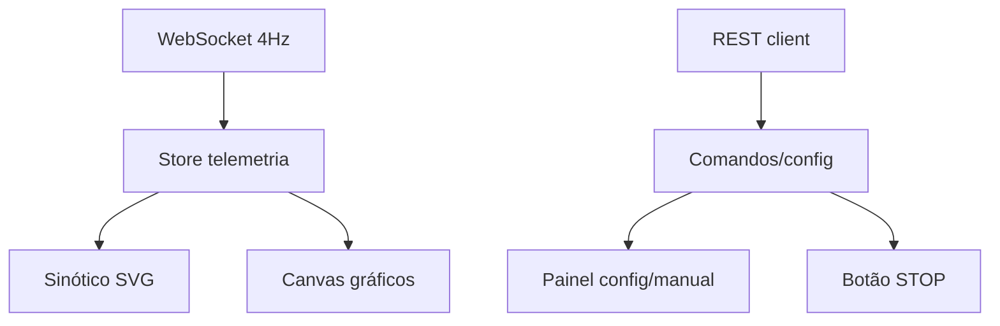

# IHM Web (Frontend) Design

**Spec**: `.specs/features/ihm-web/spec.md`
**Status**: Draft

---

## Architecture Overview

SPA React (Vite + TS) com um store central alimentado por WebSocket (4 Hz) e um cliente de API REST para comandos/configuração. Gráficos em canvas customizado para desempenho. A estética segue a skill **frontend-design**: tema escuro "instrumento de laboratório", tipografia distintiva, grade assimétrica e micro-interações.



---

## Code Reuse Analysis

| Component | Location | How to Use |
| --------- | -------- | ---------- |
| frontend-design (skill) | skill | Direção estética, tipografia e motion |
| Contratos telemetria/API | TDD | Payloads e endpoints |

## Integration Points

| System  | Integration Method                    |
| ------- | ------------------------------------- |
| Backend | `/ws/telemetry` + REST `/api/*`       |

---

## Components

### TelemetryStore
- **Purpose**: estado global de telemetria + buffer de séries.
- **Location**: `frontend/src/store/telemetry.ts`
- **Interfaces**:
  - `applyTelemetry(payload)` — atualiza estado e buffer.
  - `series(range)` — retorna janela de séries.
- **Dependencies**: nenhum.
- **Reuses**: payload do TDD.

### ApiClient
- **Purpose**: chamadas REST (config/control/manual).
- **Location**: `frontend/src/api/client.ts`
- **Interfaces**:
  - `getConfig()`, `putConfig(params)`
  - `start()`, `stop()`, `emergency()`, `manual(state)`
- **Dependencies**: fetch.

### TrendChart
- **Purpose**: gráfico canvas de VP×SP, °C/s e PWM.
- **Location**: `frontend/src/components/TrendChart.tsx`
- **Interfaces**:
  - `props: { series }` — renderiza séries em canvas.
- **Dependencies**: TelemetryStore.

### Synoptic
- **Purpose**: fluxograma SVG animado.
- **Location**: `frontend/src/components/Synoptic.tsx`
- **Interfaces**:
  - `props: { telemetry }` — destaca ativos (azul/vermelho).
- **Dependencies**: TelemetryStore.

### ManualPanel
- **Purpose**: matriz de botões SV1–SV5, bomba e sliders VM.
- **Location**: `frontend/src/components/ManualPanel.tsx`
- **Interfaces**:
  - `props: { onCommand }`.
- **Dependencies**: ApiClient.

### ConfigPanel
- **Purpose**: entradas T₁/T₂/T₃, rampa, N₂, PID com LER/ESCREVER.
- **Location**: `frontend/src/components/ConfigPanel.tsx`
- **Interfaces**:
  - `props: { onRead, onWrite }`.
- **Dependencies**: ApiClient.

### StopButton
- **Purpose**: STOP de alta prioridade.
- **Location**: `frontend/src/components/StopButton.tsx`
- **Interfaces**:
  - `props: { onEmergency }`.
- **Dependencies**: ApiClient.

### StatusBar / Alerts
- **Purpose**: indicadores de fase, status e alertas.
- **Location**: `frontend/src/components/StatusBar.tsx`
- **Interfaces**:
  - `props: { telemetry, alerts }`.
- **Dependencies**: TelemetryStore.

---

## Data Models

### Telemetry (TS)

```ts
interface Telemetry {
  ts: number
  temp: { t1: number; t2: number }
  sp: { u: number; f2: number }
  pwm: { u: number; f2: number }
  rate_c_per_s: number
  state: string
  valves: Record<string, number>
  pump: number
  error_code: number
}
```

---

## Error Handling Strategy

| Error Scenario         | Handling                          | User Impact                |
| ---------------------- | --------------------------------- | --------------------------- |
| WebSocket desconectado | Reconexão automática + indicador  | Banner de desconexão        |
| 422 na configuração    | Destacar campos inválidos         | Operador corrige            |
| Falha no comando       | Toast de erro                     | Feedback imediato           |

---

## Tech Decisions

| Decision          | Choice                   | Rationale                                    |
| ----------------- | ------------------------ | -------------------------------------------- |
| Framework         | React 18 + Vite + TS     | Ecossistema, HMR, build rápido               |
| Gráficos          | Canvas customizado       | 4 Hz com 60 fps sem lib pesada               |
| Estética          | skill frontend-design    | Visual distinto, não-genérico                |
| Estado            | Zustand (leve)           | Buffer de séries com pouca fricção           |
