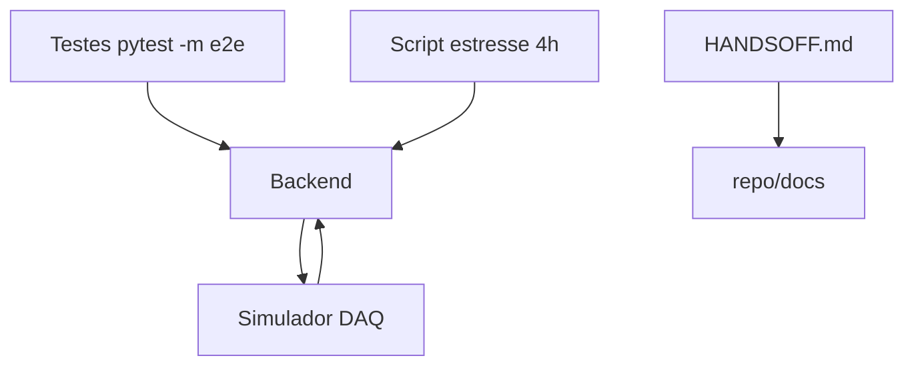

# Integração e Testes de Sistema Design

**Spec**: `.specs/features/integracao-sistema/spec.md`
**Status**: Draft

---

## Architecture Overview

Um simulador Python emula o DAQ na mesma porta serial (ou socket virtual). Os testes E2E dirigem o backend contra o simulador; o teste de segurança corta a comunicação para validar watchdog + Safe State; o estresse mede perda de pacotes.

---

## Code Reuse Analysis

| Component        | Location                    | How to Use                  |
| ---------------- | --------------------------- | --------------------------- |
| Contratos JSON   | TDD                         | Simulador emula write/read  |
| Backend tests    | backend/tests/              | Estende para E2E            |
| Simulador        | backend/tests/simulator.py  | Reutilizado por E2E/estresse|

## Integration Points

| System   | Integration Method                |
| -------- | --------------------------------- |
| Backend  | porta serial virtual (socat/pty)  |
| Firmware | mesmo protocolo JSON (emulado)    |

---

## Components

### DaqSimulator
- **Purpose**: emular o Arduino respondendo ao protocolo JSON.
- **Location**: `backend/tests/simulator.py`
- **Interfaces**:
  - `start(port)` / `stop()`
  - `respond_to(command)` — gera JSON de leitura.
  - `fail()` — para de responder (testa watchdog).
- **Dependencies**: pyserial.

### E2E Suite
- **Purpose**: validar ciclo T₀→T₃.
- **Location**: `backend/tests/test_e2e.py`
- **Interfaces**: cenários por fase.

### SafetyTest
- **Purpose**: validar watchdog + Safe State.
- **Location**: `backend/tests/test_safety.py`
- **Interfaces**: corte de serial.

### StressRunner
- **Purpose**: medir perda de pacotes em 4 h.
- **Location**: `backend/tests/stress_4hz.py`
- **Interfaces**: contador de pacotes + relatório.

---

## Data Models

N/A (usa os contratos JSON existentes do TDD).

---

## Error Handling Strategy

| Error Scenario         | Handling                          | User Impact                |
| ---------------------- | --------------------------------- | --------------------------- |
| Simulador falha        | Teste reporta falha com contexto  | Debug claro                 |
| Corte de serial        | Assert de Safe State + watchdog   | Comprova segurança          |

---

## Tech Decisions

| Decision            | Choice                | Rationale                             |
| ------------------- | --------------------- | ------------------------------------- |
| Porta serial virtual | socat/pty             | Testa o código real sem hardware      |
| E2E                 | pytest `-m e2e`       | Integra ao gate existente             |
