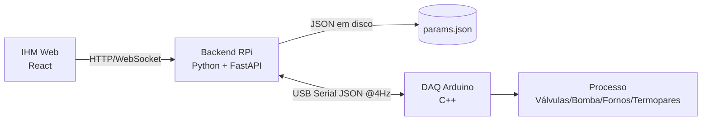

# ESPECIAÇÃO DE MERCÚRIO — Automação e IHM

[](#arquitetura)
[](#firmware)
[](#ihm)

Sistema de automação e supervisão para **preparação de amostras em especiação de mercúrio**: controle do acionamento das válvulas, bomba e aquecedores, e controle da rampa de temperatura do Tubo U (−50 → 230 °C) e do Forno 2 (700 °C), com Raspberry Pi (Python), Arduino Uno (DAQ em tempo real) e IHM Web.

> [!NOTE]
> Este projeto moderniza um sistema legado (LabVIEW) e é guiado pelas especificações em [`docs/especificacao.md`](docs/especificacao.md) e [`docs/requisitos.md`](docs/requisitos.md).

## Funcionalidades

- 🔁 **Ciclo automático T₀ → T₃** com Máquina de Estados Finita (derivação, criofocalização, rampa e purga).
- 🌡️ **Controle PID misto**: rampa dinâmica no Tubo U (razão de taxas abaixo de 0 °C, PID acima) e setpoint fixo de 700 °C no Forno 2.
- 🖥️ **IHM Web** com sinótico animado (azul = fluxo de hélio/vapor, vermelho = resistência ativa), gráficos de tendência (VP × SP, °C/s, PWM) em tempo real a 4 Hz.
- 🔧 **Modo manual** com controle direto de válvulas (SV1–SV5), bomba e aquecedores.
- 💾 **Persistência de parâmetros** (ganhos PID, tempos, rampa, setpoints) em JSON com backup rotativo.
- 🛡️ **Segurança**: watchdog no Arduino (desliga fornos em ≤ 1 s sem pacotes) e botão STOP de alta prioridade.

## Arquitetura

Topologia mestre-escravo: o **Raspberry Pi** executa a lógica de alto nível (FSM, PID, persistência e IHM); o **Arduino Uno** opera como DAQ em tempo real (I/O, PWM e leitura de termopares via SPI), isolando a execução de campo da aplicação.



| Componente | Tecnologia | Pasta | Comunicação |
| ---------- | ---------- | ----- | ----------- |
| Backend    | Python 3.11+ · FastAPI · pyserial | `backend/` | HTTP/WS :8000 |
| Firmware   | C++ · ArduinoJson · PlatformIO | `firmware/` | USB serial 115200 baud |
| IHM Web    | React 18 · Vite · TypeScript | `frontend/` | servida pelo backend |

## Pré-requisitos

- Python 3.11+
- Node.js 18+ e npm
- PlatformIO Core (`pip install platformio` ou [site oficial](https://platformio.org/install/cli))
- `socat` (opcional — usado nos testes E2E sem hardware)

## Instalação

```bash
git clone <url-do-repositorio>
cd especiacao-mercurio-ihm

# Backend (venv + dependências)
cd backend
python3 -m venv .venv
.venv/bin/pip install -r requirements-dev.txt
cd ..

# Frontend (dependências + build da IHM)
cd frontend
npm install
npm run build
cd ..
```

## Execução

### Início rápido (servidor único)

```bash
./scripts/start.sh              # backend + IHM em http://localhost:8000
./scripts/start.sh --dev        # + servidor de desenvolvimento do frontend (:5173)
./scripts/stop.sh               # encerra os serviços
```

> [!TIP]
> Configure a porta serial do Arduino antes de iniciar: `SERIAL_PORT=/dev/ttyACM0 ./scripts/start.sh`

### Configuração

| Variável | Padrão | Descrição |
| -------- | ------ | --------- |
| `SERIAL_PORT` | `/dev/ttyUSB0` | Porta serial do Arduino |
| `PORT` | `8000` | Porta HTTP/WS do backend |
| `HOST` | `0.0.0.0` | Interface de escuta |

## IHM — Uso

1. **Modo AUTO / MANUAL**: selecione no cabeçalho. Em **MANUAL**, os controles de válvulas, bomba e aquecedores são habilitados para operação direta; em **AUTO**, eles ficam bloqueados.
2. **INICIAR**: executa o ciclo automático T₀ → T₃. **PARAR** encerra o processo com retorno ao *Safe State*.
3. **STOP**: parada de emergência de alta prioridade.
4. **Sinótico**: fluxograma indica a **fase atual**, temperaturas (T1/T2), taxa de variação (°C/s) e o estado do copo de N₂.
5. **Configuração do Método**: edite tempos T₁/T₂/T₃, rampa, temperatura do N₂ e ganhos PID; use **LER** (recarrega) e **ESCREVER** (persiste em disco).

## Firmware

```bash
./scripts/firmware.sh build    # compila para Arduino Uno
./scripts/firmware.sh upload   # compila e grava via USB
```

## Testes

```bash
./scripts/test.sh all           # backend + frontend + firmware
./scripts/test.sh backend       # pytest (unit + integração + E2E com simulador)
./scripts/test.sh frontend      # vitest
./scripts/test.sh firmware      # PlatformIO (host-based)
```

> [!NOTE]
> Os testes E2E usam `socat` para criar uma serial virtual e o simulador em `backend/tests/simulator.py` — não exigem hardware físico.

## API

| Método | Endpoint | Descrição |
| ------ | -------- | --------- |
| GET | `/api/config` | Parâmetros persistidos |
| PUT | `/api/config` | Valida e persiste parâmetros |
| POST | `/api/control/start` | Inicia o ciclo automático |
| POST | `/api/control/stop` | Para o processo (Safe State) |
| POST | `/api/control/emergency` | STOP de alta prioridade |
| PUT | `/api/control/mode` | `{ "mode": "auto" \| "manual" }` |
| PUT | `/api/manual` | Override manual de atuadores |
| WS | `/ws/telemetry` | Telemetria em tempo real (4 Hz) |

## Estrutura do projeto

```
├── backend/        # Python + FastAPI (FSM, PID, persistência, API + WebSocket)
├── firmware/       # Arduino Uno (PlatformIO): I/O, PWM, termopares SPI, watchdog
├── frontend/       # React + Vite + TS: sinótico, gráficos, controles e configuração
├── scripts/        # start.sh · stop.sh · firmware.sh · test.sh
├── docs/           # Especificação, requisitos, HANDSOFF e TDD
└── .specs/         # Planejamento Spec-Driven (spec/design/tasks por feature)
```

## Documentação

- **[HANDSOFF](docs/HANDSOFF.md)** — guia de operação, arquitetura e integração para dar continuidade ao projeto.
- **[TDD](docs/TDD.md)** — documento de design técnico.
- **[Especificação](docs/especificacao.md)** e **[Requisitos](docs/requisitos.md)** — base do processo analítico.
- **[.specs](.specs/)** — planejamento Spec-Driven com specs, designs e tasks por feature.

## Autoria

- William da Silva Vianna
- Renato Gomes Sobral Barcellos
------

Desenvolvido com auxílio do TDD (Test-Driven Development) e Spec-Driven Development (SDD) para garantir rastreabilidade entre requisitos, design, implementação e testes.

Implementação baseada em [especificações](.specs/) e [requisitos](docs/requisitos.md) do sistema de automação para especiação de mercúrio.

Execução da implementação com auxílio dos modelos de inteligência artificial DeepSeek V4 Flash e Pro.

------
Se gostou deixe um like ⭐ no repositório e compartilhe com colegas de laboratório.
Se não gostou também deixe um like ⭐ e abra uma issue com sugestões de melhoria.
------
