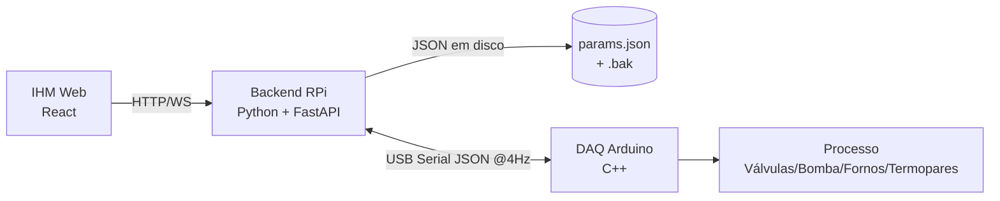

# HANDSOFF — Sistema de Especiação de Mercúrio

Guia de operação e integração do sistema modernizado (RPi + Arduino + IHM Web).

---

## 1. Visão geral

| Componente | Tecnologia          | Pasta    | Porta/comunicação        |
| ---------- | ------------------- | -------- | ------------------------ |
| Backend    | Python + FastAPI    | `backend/` | HTTP/WS na porta **8000** |
| Firmware   | Arduino Uno (C++)   | `firmware/` | USB serial @115200 baud |
| IHM Web    | React + Vite + TS   | `frontend/` | servida pelo backend     |

Topologia mestre-escravo: o RPi (mestre) executa a FSM/PID e envia comandos; o Arduino (escravo/DAQ) executa em tempo real e lê termopares.

---

## 1.1 Arquitetura e fluxo de dados



**Responsabilidades por módulo:**

- **Backend (`backend/app/`)**
  - `fsm.py` — Máquina de Estados (SAFE, T₀–T₃, MANUAL) + matriz de atuadores.
  - `pid.py` / `ramp.py` — PID do Forno 2 e rampa do Tubo U (razão de taxas T<0, PID T≥0) + °C/s.
  - `serial_link.py` — enlace pyserial com codec JSON e reconexão.
  - `loop.py` — thread de controle a 4 Hz, watchdog (1 s sem resposta → SAFE) e telemetria.
  - `config_store.py` — persistência atômica de parâmetros com backup rotativo.
  - `api.py` / `main.py` — API REST + WebSocket e fábrica da aplicação.
- **Firmware (`firmware/`)**
  - `src/pin_map.h` — mapa de I/O e Safe State.
  - `src/actuator_driver.*` — aplica válvulas/bomba/PWM.
  - `src/thermocouple_reader.*` — leitura SPI dos termopares (MAX31855).
  - `lib/daqcore/` — parser JSON e watchdog (portáveis, testáveis em host).
- **Frontend (`frontend/src/`)**
  - `App.tsx` — layout, seletor AUTO/MANUAL e integração WS.
  - `components/Synoptic.tsx` — fluxograma com fase atual e leituras.
  - `components/TrendChart.tsx` — gráficos VP×SP, °C/s e PWM (canvas).
  - `components/ManualPanel.tsx` — controles manuais (habilitados no modo manual).
  - `components/ConfigPanel.tsx` — parâmetros com LER/ESCREVER.

**Fluxo típico (ciclo a 250 ms):**

1. Backend envia JSON de escrita (válvulas/bomba/PWM) ao DAQ.
2. DAQ lê termopares e responde JSON de leitura (T1/T2, status, erro).
3. Backend atualiza a FSM (PID/rampa) e publica telemetria no WebSocket.
4. IHM renderiza sinótico + gráficos a partir da telemetria.

---

## 2. Como executar

### Backend + IHM

> **Recomendado:** use os scripts prontos (veja §9) — `./scripts/start.sh`, `./scripts/stop.sh`.

```bash
cd backend
python3 -m venv .venv && .venv/bin/pip install -r requirements.txt
SERIAL_PORT=/dev/ttyUSB0 .venv/bin/python -m app
# IHM em http://<ip-do-rpi>:8000
```

Variáveis de ambiente:

| Variável     | Default        | Descrição                       |
| ------------ | -------------- | ------------------------------- |
| `SERIAL_PORT`| `/dev/ttyUSB0` | Porta serial do Arduino         |
| `HOST`       | `0.0.0.0`      | Interface de escuta             |
| `PORT`       | `8000`         | Porta HTTP/WS                   |

### Firmware

```bash
cd firmware
pio run -e uno          # compila
pio run -e uno -t upload  # grava no Arduino (via USB)
```

---

## 3. Endereçamento de portas seriais

- **Linux/RPi:** identificar com `ls /dev/ttyUSB* /dev/ttyACM*` e `dmesg | grep tty` após conectar o Arduino.
- **USB-UART (CH340/CP210x):** `/dev/ttyUSB0`
- **Arduino nativo (ATMega16U2):** `/dev/ttyACM0`
- Configurar via `SERIAL_PORT` antes de iniciar o backend. Se a porta mudar, o backend tenta reconectar no próximo ciclo (4 Hz).

> **Validação:** `python -m tests.stress_4hz --duration 10` testa o enlace a 4 Hz com simulador via socat.

---

## 4. Mapeamento JSON (RPi ↔ Arduino)

### Handshake de parametrização (RPi → DAQ, no connect)

```json
{
  "cmd": "config",
  "pid_u":  { "kp": 5.0,  "ti": 1.8,  "td": 0.0 },
  "pid_f2": { "kp": 44.67, "ti": 0.18, "td": 0.0 }
}
```

### Escrita (ciclo de controle, 4 Hz)

```json
{
  "valves": { "sv1": 1, "sv2": 0, "sv3": 0, "sv4": 0, "sv5": 1 },
  "pump": 1,
  "pwm": { "u": 128, "f2": 255 }
}
```

> `pwm.u` = VM do Forno 1 (Tubo U); `pwm.f2` = VM do Forno 2 (Atomizador), 0–255.

### Leitura (ciclo de aquisição)

```json
{
  "temp": { "t1": -45.2, "t2": 699.5 },
  "status": "active",
  "error_code": 0
}
```

### Telemetria (Backend → IHM, WebSocket `/ws/telemetry`, 4 Hz)

```json
{
  "ts": 1755388800.250,
  "temp":  { "t1": -45.2, "t2": 699.5 },
  "sp":    { "u": 12.5, "f2": 700.0 },
  "pwm":   { "u": 128,  "f2": 255 },
  "rate_c_per_s": 0.42,
  "state": "T2_RAMPA",
  "valves": { "sv1": 1, "sv2": 0, "sv3": 0, "sv4": 0, "sv5": 1 },
  "pump": 1,
  "error_code": 0
}
```

### Estados possíveis (`state`)

`SAFE` · `T0_DERIV` · `T1_STAB` · `T2_RAMPA` · `T3_PURGA` · `MANUAL`

### Mapeamento de I/O (Arduino Uno)

| Componente            | Pino | Tipo    | Função                        |
| --------------------- | ---- | ------- | ----------------------------- |
| Bomba Peristáltica    | 2    | Digital | Injeção de TEBS               |
| SV3                   | 3    | Digital | Direcionamento Vapor/Tubo U   |
| SV2                   | 4    | Digital | Agitação / Purga 1            |
| SV4                   | 5    | Digital | Purga 2 (Náfion)              |
| SV5 (Pistão)          | 6    | Digital | Copo de N₂                    |
| SV1 (Hélio)           | 7    | Digital | Gás de arraste                |
| CLK (T1/T2)           | 8    | SPI     | Clock                         |
| Forno 1 (Tubo U)      | 9    | PWM     | Rampa de temperatura          |
| Forno 2 (Atomizador)  | 10   | PWM     | Estático 700 °C               |
| S0 (T1/T2)            | 11   | SPI     | MISO                          |
| CS T1 (Tubo U)        | 12   | SPI     | Chip Select termopar 1        |
| CS T2 (Forno 2)       | 13   | SPI     | Chip Select termopar 2        |

---

## 5. Matriz de estados dos atuadores

| Fase | SV1 | SV2 | SV3 | SV4 | SV5 | Bomba |
| ---- | --- | --- | --- | --- | --- | ----- |
| T₀   | 1   | 0   | 0   | 0   | 1   | 1     |
| T₁   | 1   | 0   | 0   | 0   | 1   | 0     |
| T₂   | 1   | 0   | 0   | 0   | 0   | 0     |
| T₃   | 0   | 1   | 1   | 1   | 0   | 0     |
| SAFE | 0   | 0   | 0   | 0   | 0   | 0     |

**Mapeamento de durações** (decisão registrada em `.specs/project/STATE.md`):

| Parâmetro persistido | Fase que dura           |
| -------------------- | ----------------------- |
| `times_s.t1`         | T₀ (derivação/criofocalização) |
| `times_s.t2`         | T₁ (estabilização térmica)     |
| `ramp.time_s`        | T₂ (rampa de temperatura)      |
| `times_s.t3`         | T₃ (purga total)               |

---

## 6. Interpolação da curva de aquecimento (Taxa × % PWM)

Para calcular a VM quando a temperatura do Tubo U está abaixo de 0 °C:

1. **Medir a taxa real do sistema** em bancada: com o Forno 1 em um PWM fixo conhecido, registrar a derivada de temperatura (°C/s) na faixa de interesse.
2. Construir a curva **Taxa de Aquecimento × % PWM** com alguns pontos (ex.: 20%, 50%, 80%) e interpolar linearmente entre os pontos medidos.
3. No código, informar a taxa do sistema via `RampController.set_system_rate(rate)` (calibração).
4. O controle calcula a VM:

$$\text{VM} = \frac{\text{Taxa de Aquecimento}_{\text{usuário}}}{\text{Taxa de Aquecimento}_{\text{sistema}}} \times 255$$

> Quando T ≥ 0 °C, o PID assume a malha fechada seguindo o setpoint dinâmico da rampa até 230 °C. O Coeficiente de Aquecimento (°C/s) exibido na IHM é `(target - N₂) / tempo_de_rampa`.

---

## 7. Persistência de parâmetros

- Arquivo: `backend/data/params.json` (gerado em runtime).
- Escrita **atômica** com backup rotativo em `params.json.bak`.
- Parâmetros: ganhos PID (Tubo U e Forno 2), tempos T₁/T₂/T₃, rampa (tempo, N₂, alvo), setpoint do Forno 2.
- Operação: botões **LER** (recarrega do disco) e **ESCREVER** (persiste) na IHM; a API `PUT /api/config` também valida faixas (422 em valor inválido).

---

## 8. Testes

```bash
# backend (unit + API + E2E + segurança — usa socat para serial virtual)
cd backend && .venv/bin/python -m pytest -q

# firmware (parser + watchdog, host-based) e build para Uno
cd firmware && pio test -e native && pio run -e uno

# frontend
cd frontend && npm test && npm run build

# estresse 4 Hz (simulador via socat)
cd backend && .venv/bin/python -m tests.stress_4hz --duration 3600
```

### Watchdog de segurança

- **Arduino:** sem pacote válido por > 1 s → Safe State (fornos a 0, SV5 baixo).
- **Backend:** sem resposta do DAQ por > 1 s → `EMERGENCY` → Safe State.

---

## 9. Simulação sem hardware

```bash
# cria um par de portas virtuais (socat)
socat -d -d pty,raw,echo=0 pty,raw,echo=0
# use uma das portas no simulador e a outra no backend:
SERIAL_PORT=/dev/pts/X .venv/bin/python -m app
```

O simulador do DAQ vive em `backend/tests/simulator.py` e emula o protocolo JSON.

---

## 10. Como usar o sistema (operação da IHM)

A IHM é servida pelo backend em `http://<ip-do-rpi>:8000`. Fluxo de operação:

1. **Conferir estado inicial** — o badge deve mostrar **SAFE STATE**; T1/T2 com leitura válida e "WS ok" na barra de status.
2. **Configurar o método** (painel à direita):
   - Tempos T₁/T₂/T₃ (s), tempo de rampa, temperatura do N₂, alvo (230 °C), ganhos PID e setpoint do Forno 2 (700 °C).
   - **ESCREVER** persiste em disco; **LER** recarrega. (Parâmetros são persistentes entre execuções.)
3. **Modo AUTOMÁTICO** (padrão):
   - Pressione **INICIAR** → o sistema percorre T₀ → T₃ automaticamente.
   - Acompanhe a **fase atual** no sinótico/badge, as temperaturas e a taxa de variação (°C/s).
   - **PARAR** encerra o ciclo (volta ao Safe State).
4. **Modo MANUAL** (operação direta):
   - Selecione **MANUAL** no cabeçalho → os controles de válvulas (SV1–SV5), bomba e aquecedores (sliders de VM) são habilitados.
   - Acione os dispositivos diretamente; cada ação é enviada ao DAQ via `PUT /api/manual`.
   - Selecione **AUTO** para voltar ao modo automático (retorna ao Safe State).
5. **Emergência** — **STOP** a qualquer momento: desce o copo de N₂ (SV5), desliga os fornos e retorna ao Safe State.

> [!IMPORTANT]
> Em **AUTO**, os controles manuais ficam bloqueados (proteção contra operação indevida durante o ciclo). O **INICIAR** só opera a partir do Safe State.

---

## 11. API de referência (Backend → IHM)

| Método | Endpoint                  | Descrição                                  |
| ------ | ------------------------- | ------------------------------------------ |
| GET    | `/api/config`             | Parâmetros persistidos                     |
| PUT    | `/api/config`             | Valida e persiste parâmetros               |
| POST   | `/api/control/start`      | Inicia o ciclo automático                  |
| POST   | `/api/control/stop`       | Para o processo (Safe State)               |
| POST   | `/api/control/emergency`  | STOP de alta prioridade                    |
| PUT    | `/api/control/mode`       | `{ "mode": "auto" \| "manual" }`           |
| PUT    | `/api/manual`             | Override manual de atuadores/PWM           |
| WS     | `/ws/telemetry`           | Telemetria em tempo real (4 Hz)            |

Exemplo de troca de modo:

```bash
curl -X PUT http://localhost:8000/api/control/mode -H 'Content-Type: application/json' -d '{"mode":"manual"}'
# {"state":"MANUAL"}
```

---

## 12. Scripts de automação

| Script                  | Função                                            |
| ----------------------- | ------------------------------------------------- |
| `./scripts/start.sh`    | Inicia backend (+ IHM) — opção `--dev` para Vite  |
| `./scripts/stop.sh`     | Encerra os serviços (PID files em `logs/`)        |
| `./scripts/firmware.sh` | `build` ou `upload` do firmware no Arduino Uno    |
| `./scripts/test.sh`     | Roda testes (`all`, `backend`, `frontend`, `firmware`) |

---

## 13. Guia para agentes de IA (continuidade)

Este documento é o ponto de partida para outro agente dar continuidade ao projeto.

### Estado atual

- Implementação **M1–M4 concluída e validada** (ver `.specs/project/ROADMAP.md`).
- Testes: 36 (backend) + 9 (firmware host) + 6 (frontend) — todos verdes.
- Builds: firmware para Uno OK; frontend `npm run build` OK.
- Commits em `main` (mensagens em Conventional Commits).

### Onde está cada coisa

| Assunto                        | Local                                   |
| ------------------------------ | --------------------------------------- |
| Spec/design/tasks por feature  | `.specs/features/*/`                    |
| Decisões e lições              | `.specs/project/STATE.md`               |
| Design técnico                 | `docs/TDD.md`                           |
| Contratos JSON / pinagem       | `docs/HANDSOFF.md` (§4)                 |
| Testes                         | `backend/tests/`, `frontend/src/**/*.test.ts`, `firmware/test/` |

### Como validar antes de continuar

```bash
./scripts/test.sh all
cd firmware && pio run -e uno
cd frontend && npm run build
```

### Gray areas pendentes (decisões abertas)

1. **Part number do amplificador SPI do termopar** (MAX31855 vs MAX6675) — confirmar com o hardware.
2. **Interpolação da curva Taxa × % PWM** do Tubo U — calibrar em bancada e injetar via `RampController.set_system_rate()`.
3. **Margem de proteção de temperatura** (valor que dispara STOP automático).
4. **Persistência automática vs. apenas via ESCREVER**.
5. **Porta serial definitiva** no RPi (`/dev/ttyUSB0` vs `/dev/ttyACM0`).

### Padrões do projeto (para agentes)

- **Commits atômicos** com Conventional Commits (`feat`, `fix`, `chore`, `docs`, `test`).
- **TDD**: testes antes da implementação; gate por task (ver `.specs/codebase/TESTING.md`).
- **Delegação**: tasks `[P]` de `.specs/features/*/tasks.md` podem rodar em paralelo via subagentes.
- **Não commitar**: `.venv/`, `node_modules/`, `dist/`, `.pio/`, `backend/data/` (ignorados).
- **Idioma**: comentários e docs em pt-BR; código e mensagens de commit em inglês.
