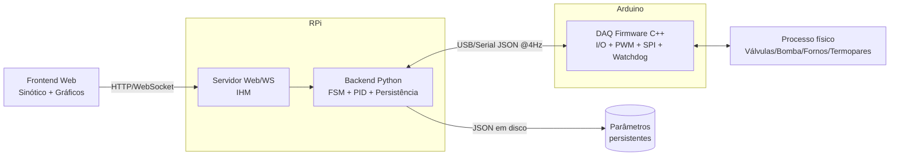
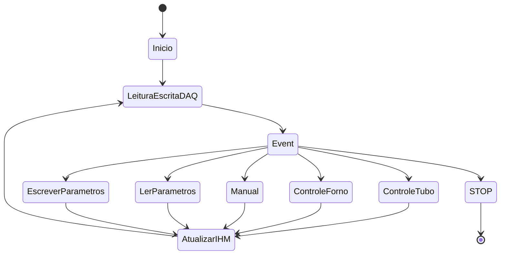

# TDD - Sistema de Automação para Especiação de Mercúrio

| Campo                | Valor                                        |
| -------------------- | -------------------------------------------- |
| Tech Lead            | A definir                                    |
| Product Manager      | A definir                                    |
| Time                 | A definir                                    |
| Epic/Ticket          | A definir                                    |
| Design/Referência    | Figuras 11–30 dos requisitos (especificação) |
| Status               | Draft                                        |
| Criado em            | 2026-08-16                                   |
| Última atualização   | 2026-08-16                                   |

---

## Contexto

O processo analítico de especiação de mercúrio exige controle rigoroso de uma sequência de etapas químicas: **derivatização** (com tetraetilborato de sódio – TEBS), **criofocalização** em nitrogênio líquido (−196 °C), **atomização térmica** (700 °C) e detecção no espectrofotômetro Lumex. A correta separação das espécies (Hg⁰, metilmercúrio, etc.) depende diretamente da qualidade da **rampa de temperatura** imposta ao Tubo U (Forno 1) e da estabilidade do **Forno 2** a 700 °C.

O sistema atual é legado (LabVIEW + hardware dedicado) e será modernizado para uma arquitetura **Python + Raspberry Pi + Arduino Uno + IHM Web**. O objetivo é aumentar a confiabilidade, a repetibilidade analítica e a segurança operacional em ambiente laboratorial, além de reduzir erro humano por meio de uma interface de supervisão mais clara.

**Domínio**: automação industrial / instrumentação analítica laboratorial.

**Stakeholders**: operadores de laboratório, responsável técnico/analista, equipe de desenvolvimento, área de segurança do laboratório.

---

## Definição do Problema & Motivação

### Problemas que estamos resolvendo

- **Controle inadequado da rampa de temperatura do Tubo U** — o sistema legado não garante linearidade da rampa de −50 °C até 230 °C, comprometendo a separação e identificação das espécies.
  - Impacto: picos sobrepostos no Lumex, análises inválidas e retrabalho.
- **Parâmetros não persistentes / pouco rastreáveis** — ganhos PID e tempos ficavam fixos ou sem persistência confiável entre execuções.
  - Impacto: repetibilidade insuficiente e dificuldade de auditoria do método.
- **Interface legada propensa a erro humano** — ausência de sinótico claro, de indicadores de tendência e de uma parada de emergência centralizada de alta prioridade.
  - Impacto: risco operacional e baixa confiança do operador.
- **Acoplamento entre lógica de aplicação e execução de tempo real** — dificulta depuração e evolução.
  - Impacto: manutenção cara e frágil.

### Por que agora?

- Necessidade de substituir o sistema legado (fim de vida útil / manutenção inviável).
- Exigência de repetibilidade analítica comprovável (gráficos de tendência e parâmetros persistentes).
- Disponibilidade de componentes de baixo custo e alta confiabilidade (RPi + Arduino) para o mesmo requisito.

### Impacto de NÃO resolver

- **Técnico**: permanência de um legado frágil, sem watchdog e sem persistência de parâmetros.
- **Laboratorial**: análises irrepetíveis, retrabalho e risco de dano ao Tubo U (congelamento permanente) ou sobreaquecimento.
- **Segurança**: ausência de parada segura automática em caso de falha de comunicação.

---

## Escopo

### ✅ No escopo (V1 – MVP)

- Backend em Python no Raspberry Pi com Máquina de Estados Finita (FSM).
- Firmware Arduino (C++) como DAQ: saídas digitais, PWM dos fornos e leitura de termopares via SPI.
- Protocolo JSON estruturado entre RPi e Arduino (Loop Rate de 4 Hz).
- IHM Web com:
  - Sinótico animado do processo (fluxo azul = hélio/vapor; vermelho = resistências ativas).
  - Gráficos de tendência de temperatura (VP × SP) e do Coeficiente de Aquecimento (°C/s).
  - Matriz de controles manuais (SV1–SV5, Bomba, sliders de VM).
  - Painel de configuração (T₁, T₂, T₃, Tempo de Rampa, Temperatura do N₂).
  - Botão STOP de alta prioridade.
- Controle PID: Forno 2 (setpoint fixo 700 °C) e Forno 1 (rampa dinâmica até 230 °C com estratégia mista).
- **Persistência dos parâmetros ajustados** em disco (arquivo JSON), com operações de leitura/escrita.
- Watchdog no Arduino: desligamento dos fornos se não houver pacotes por > 1 s.
- Repositório estruturado: `/backend`, `/frontend`, `/firmware`, `/docs`.

### ❌ Fora do escopo (V1)

- Integração automática com o detector Lumex (apenas indicação de início de leitura).
- Calibração automática de termopares.
- Controle de vazão dos rotâmetros (regulagem manual).
- Autenticação multi-usuário / controle de acesso baseado em papéis (V2).
- Log remoto em nuvem / telemetria externa.

### 🔮 Considerações futuras (V2+)

- Autenticação e perfis de operador com trilha de auditoria.
- Exportação de curvas (CSV/PDF) e assinatura de método.
- Sintonização automática (auto-tune) dos PIDs.
- Simulador de processo para treinamento.

---

## Solução Técnica

### Visão geral da arquitetura

Topologia **mestre-escravo**: o Raspberry Pi executa a lógica de alto nível (FSM, PID e IHM) e o Arduino Uno opera como DAQ em tempo real, isolando a execução de campo da aplicação.



**Componentes principais**:

- **Backend RPi (Python)**: orquestra a FSM, executa as malhas PID (Tubo U e Forno 2), calcula a rampa e o Coeficiente de Aquecimento, persiste parâmetros e expõe API/WebSocket para a IHM.
- **Firmware Arduino (C++)**: aplica comandos de atuadores, lê termopares via SPI, gera PWM dos fornos e implementa watchdog de segurança.
- **Frontend Web (IHM)**: supervisiona e comanda o processo; renderiza sinótico e gráficos de tendência.
- **Persistência (disco RPi)**: arquivo JSON com todos os parâmetros ajustáveis do método.

### Fluxo de dados

1. Operador insere parâmetros na IHM (tempos, rampa, temperatura do N₂, ganhos PID).
2. Frontend envia ao Backend, que valida e persiste em disco.
3. Backend envia **Handshake de Parametrização** ao DAQ (ganhos PID).
4. Em ciclo contínuo de 250 ms: Backend envia **JSON de Escrita** (válvulas, bomba, PWM) e recebe **JSON de Leitura** (temperaturas, status, erro).
5. Backend calcula setpoints, VM (PWM) e Coeficiente de Aquecimento; propaga telemetria ao Frontend via WebSocket.
6. Frontend plota VP × SP e °C/s nos gráficos de tendência.
7. Em emergência (comando STOP ou perda de comunicação), o sistema retorna ao Safe State; no Arduino, o watchdog desliga os fornos.

### Contratos de interface

#### RPi → Arduino: Handshake de Parametrização

Enviado no início da execução para configurar os ganhos fixos dos controladores:

```json
{
  "cmd": "config",
  "pid_u":  { "kp": 5.0,  "ti": 1.8,  "td": 0.0 },
  "pid_f2": { "kp": 44.67, "ti": 0.18, "td": 0.0 }
}
```

#### RPi → Arduino: JSON de Escrita (ciclo de controle)

```json
{
  "valves": { "sv1": 1, "sv2": 0, "sv3": 0, "sv4": 0, "sv5": 1 },
  "pump": 1,
  "pwm": { "u": 128, "f2": 255 }
}
```

> `pwm.u` e `pwm.f2` são os **valores efetivamente enviados às resistências de aquecimento** do Forno 1 (Tubo U) e do Forno 2 (Atomizador), respectivamente (0–255).

#### Arduino → RPi: JSON de Leitura (ciclo de aquisição)

```json
{
  "temp": { "t1": -45.2, "t2": 699.5 },
  "status": "active",
  "error_code": 0
}
```

#### Backend → Frontend: telemetria (WebSocket, 4 Hz)

```json
{
  "ts": 1755388800.250,
  "temp":  { "t1": -45.2, "t2": 699.5 },
  "sp":    { "u": 12.5, "f2": 700.0 },
  "pwm":   { "u": 128,  "f2": 255 },
  "rate_c_per_s": 0.42,
  "state": "T2_RAMPA",
  "valves": { "sv1": 1, "sv2": 0, "sv3": 0, "sv4": 0, "sv5": 1 },
  "pump": 1,
  "error_code": 0
}
```

### Mapeamento de I/O (Arduino Uno)

| Componente                  | Pino | Tipo    | Função no processo                       |
| --------------------------- | ---- | ------- | ---------------------------------------- |
| Bomba Peristáltica          | 2    | Digital | Injeção de solução TEBS                  |
| SV3 (Válvula 3-vias)        | 3    | Digital | Direcionamento Vapor/Tubo U              |
| SV2 (Válvula 3-vias)        | 4    | Digital | Agitação de Amostra / Purga 1            |
| SV4 (Válvula Solenóide)     | 5    | Digital | Entrada de gás para Purga 2 (Náfion)     |
| SV5 (Pistão Criogênico)     | 6    | Digital | Acionamento do Copo de N₂                |
| SV1 (Válvula de Hélio)      | 7    | Digital | Entrada de gás de arraste (T₀, T₁, T₂)   |
| CLK (Sensores T1/T2)        | 8    | SPI     | Clock da comunicação serial              |
| Forno 1 (Tubo U)            | 9    | PWM     | Controle de rampa de temperatura         |
| Forno 2 (Atomizador)        | 10   | PWM     | Controle estático (700 °C)               |
| S0 (Sensores T1/T2)         | 11   | SPI     | MISO – dados dos termopares              |
| CS (T1 – Tubo U)            | 12   | SPI     | Chip Select Termopar 1                   |
| CS (T2 – Forno 2)           | 13   | SPI     | Chip Select Termopar 2                   |

### Máquina de Estados Finita (FSM)



- **Início (Safe State)**: todas as saídas (SV1–SV5, Bomba, PWMs) em zero; SV5 mantido em nível baixo por segurança.
- **Leitura/Escrita DAQ**: troca de pacotes JSON a 250 ms (4 Hz).
- **Event**: listener de comandos (Iniciar, Parar, STOP, Manual).
- **Controle Tubo / Controle Forno**: execução das malhas PID.
- **Manual**: override total dos atuadores para manutenção.
- **Ler/Escrever Parâmetros**: persistência em disco.
- **STOP / Emergência**: SV5 desativado (desce o copo) e todos os aquecedores desligados.

### Sequenciamento do processo — Matriz de Estados dos Atuadores

| Fase | Descrição                        | SV1 | SV2 | SV3 | SV4 | SV5 | Bomba |
| ---- | -------------------------------- | --- | --- | --- | --- | --- | ----- |
| T₀   | Derivação / Criofocalização      | 1   | 0   | 0   | 0   | 1   | 1     |
| T₁   | Estabilização Térmica            | 1   | 0   | 0   | 0   | 1   | 0     |
| T₂   | Rampa de Aquecimento / Purga     | 1   | 0   | 0   | 0   | 0   | 0     |
| T₃   | Purga Total / Limpeza            | 0   | 1   | 1   | 1   | 0   | 0     |

### Estratégia de Controle PID e Rampa

O sistema usa **PID misto**:

- **Forno 2**: setpoint fixo de **700 °C**.
- **Forno 1 (Tubo U)**: rampa dinâmica com duas regiões:
  - Se `T_inicial < 0 °C`: PWM calculado pela razão
    $$\text{PWM} = \frac{\text{Taxa de Aquecimento}_{\text{usuário}}}{\text{Taxa de Aquecimento}_{\text{sistema}}}$$
  - Se `T ≥ 0 °C`: PID em malha fechada mantém a linearidade da rampa até **230 °C**.
- O **Coeficiente de Aquecimento (°C/s)** é calculado a partir do tempo de rampa informado pelo usuário e exibido na IHM.

> **Piso de leitura**: o termopar tipo K reporta leituras confiáveis a partir de **−50 °C**, mesmo com o N₂ a −196 °C. A rampa de controle considera −50 °C como temperatura inicial efetiva.

### Persistência dos Parâmetros Ajustados

Os parâmetros ajustados pelo operador **devem ser persistentes** entre execuções. O modelo de persistência é um **documento JSON gravado em disco no RPi**, com leitura/escrita atômica.

**Modelo de dados persistido**:

```json
{
  "version": 1,
  "updated_at": "2026-08-16T10:00:00Z",
  "pid_u":   { "kp": 5.0,  "ti": 1.8,  "td": 0.0 },
  "pid_f2":  { "kp": 44.67, "ti": 0.18, "td": 0.0 },
  "times_s": { "t1": 60, "t2": 360, "t3": 60 },
  "ramp": {
    "time_s": 300,
    "nitrogen_temp_c": -50,
    "target_temp_c": 230
  },
  "setpoints": { "f2_c": 700.0 }
}
```

**Regras de persistência**:

- Escrita ocorre ao acionar **ESCREVER** e, opcionalmente, ao final de uma edição validada na IHM.
- Leitura ocorre na **inicialização do Backend** e ao acionar **LER**.
- Validação de faixas antes da escrita (ex.: `0 < t1..t3`, `ramp.time_s > 0`, `target_temp_c ≤ 230`).
- Backups rotativos do arquivo anterior em caso de falha na gravação.

### Gráficos de Tendência da Temperatura (Requisito obrigatório)

A IHM deve exibir, em tempo real:

1. **Gráfico de Temperatura** — VP (t1 e t2) × SP (rampa dinâmica do Tubo U e setpoint fixo do Forno 2) ao longo do tempo.
2. **Gráfico do Coeficiente de Aquecimento (°C/s)** — valor calculado e medido durante a rampa.
3. **Indicação da VM (PWM %)** enviada a cada resistência — correlacionando o acionamento com a resposta térmica.

**Contrato de dados da série temporal** (buffered no Backend e transmitido ao Frontend):

```json
{
  "series": {
    "t1_vp":  [-50.0, -45.2, -40.1],
    "t1_sp":  [-50.0, -45.0, -40.0],
    "t2_vp":  [699.5, 699.8, 700.1],
    "t2_sp":  [700.0, 700.0, 700.0],
    "pwm_u":  [128, 127, 126],
    "pwm_f2": [255, 254, 255],
    "rate_c_per_s": [0.42, 0.41, 0.43],
    "ts": [1755388800.000, 1755388800.250, 1755388800.500]
  }
}
```

**Requisitos funcionais dos gráficos**:

- Amostragem em 4 Hz; buffer mínimo de 15 minutos de histórico em memória.
- Sobreposição de VP e SP com escalas legíveis e legenda.
- Exibição obrigatória do **Coeficiente de Aquecimento (°C/s)** calculado.
- Destaque visual das mudanças de fase (T₀→T₃).

### API do Backend (IHM)

| Endpoint                   | Método | Descrição                                          |
| -------------------------- | ------ | -------------------------------------------------- |
| `/api/config`              | GET    | Retorna parâmetros persistidos                     |
| `/api/config`              | PUT    | Valida e persiste parâmetros                       |
| `/api/control/start`       | POST   | Inicia o processo automático                       |
| `/api/control/stop`        | POST   | Para o processo (retorno ao Safe State)            |
| `/api/control/emergency`   | POST   | STOP de alta prioridade                            |
| `/api/manual`              | PUT    | Aplica override manual de atuadores/PWM            |
| `/ws/telemetry`            | WS     | Stream de telemetria em tempo real (4 Hz)          |

---

## Riscos

| Risco                                          | Impacto | Probabilidade | Mitigação                                                                 |
| ---------------------------------------------- | ------- | ------------- | ------------------------------------------------------------------------- |
| Perda de comunicação serial (RPi↔Arduino)      | Alto    | Média         | Watchdog no Arduino desliga fornos após 1 s sem pacotes; alarme na IHM    |
| Sobre-aquecimento do Tubo U / Forno 2          | Alto    | Baixa         | STOP de alta prioridade; limite de temperatura; relé de segurança         |
| Congelamento permanente do Tubo U              | Alto    | Baixa         | SV5 abaixa copo em falha; desligamento imediato dos aquecedores           |
| Leitura imprecisa do termopar abaixo de −50 °C | Médio   | Alta          | Piso de leitura tratado na lógica de rampa; calibração do sensor           |
| Corrupção do arquivo de parâmetros persistidos | Médio   | Baixa         | Escrita atômica + backup rotativo + validação de schema                    |
| Deriva dos ganhos PID entre métodos            | Médio   | Média         | Parametrização persistente por método; testes de sintonia                   |
| Erro humano no modo Manual                     | Médio   | Média         | Confirmação de ações críticas; indicadores de estado claros                 |
| Escopo crescente (scope creep)                 | Médio   | Alta          | Escopo V1 congelado; processo de mudança documentado                        |

**Legenda**: Impacto Alto = dano ao equipamento/amostra ou risco à segurança; Médio = degradação do processo; Baixo = inconveniente.

---

## Plano de Implementação

| Fase                      | Tarefa                                   | Descrição                                             | Responsável | Status | Estimativa |
| ------------------------- | ---------------------------------------- | ----------------------------------------------------- | ----------- | ------ | ---------- |
| **F1 – Setup**            | Estrutura do repositório                 | Criar `/backend`, `/frontend`, `/firmware`, `/docs`    | A definir   | TODO   | 1d         |
|                           | Ambiente RPi / toolchain Arduino         | Configurar Python e toolchain C++                     | A definir   | TODO   | 1d         |
| **F2 – Firmware**         | I/O digital + PWM                        | Acionamento SV1–SV5, bomba, PWMs                      | A definir   | TODO   | 3d         |
|                           | SPI termopares                           | Leitura T1/T2                                         | A definir   | TODO   | 2d         |
|                           | Protocolo JSON + Watchdog                | Parser, respostas e watchdog de segurança             | A definir   | TODO   | 3d         |
| **F3 – Backend**          | FSM                                      | Estados Início/DAQ/Event/Controle/Manual/STOP         | A definir   | TODO   | 4d         |
|                           | PID + Rampa                              | Malhas Forno 1/2 e cálculo de °C/s                    | A definir   | TODO   | 4d         |
|                           | Persistência                             | Leitura/escrita atômica de parâmetros (JSON)          | A definir   | TODO   | 2d         |
|                           | API + WebSocket                          | Endpoints de config/control e stream de telemetria    | A definir   | TODO   | 3d         |
| **F4 – Frontend**         | Sinótico + Controles manuais             | Fluxograma animado e matriz de botões                | A definir   | TODO   | 4d         |
|                           | Gráficos de tendência                    | VP×SP, °C/s e PWM das resistências                   | A definir   | TODO   | 3d         |
|                           | Painel de configuração                   | Entradas T₁/T₂/T₃, rampa, N₂, ganhos PID             | A definir   | TODO   | 2d         |
| **F5 – Testes**           | Unitários / Integração / Funcional       | Parser JSON, rampa, estresse 4 Hz, ciclo T₀→T₃        | A definir   | TODO   | 5d         |
|                           | Segurança                                | Perda de serial, watchdog, STOP                       | A definir   | TODO   | 2d         |
| **F6 – Entrega**          | Documentação + HANDSOFF                  | Mapeamento JSON, endereçamento serial, interpolação   | A definir   | TODO   | 2d         |

**Total estimado**: ~41 dias (≈ 8 semanas).

**Dependências**: F2 antes de F3 (contrato serial); F3 antes de F4 (API/WS); F5 exige F2–F4.

---

## Considerações de Segurança

### Segurança operacional (equipamento e pessoas)

- **Safe State por padrão**: inicialização com todas as saídas em zero e SV5 (pistão) em nível baixo.
- **Watchdog no Arduino**: desliga fornos se não houver pacotes por mais de 1 s.
- **STOP de alta prioridade**: retorno imediato ao Safe State, independente do estado corrente.
- **Limites de temperatura**: proteção por software contra sobreaquecimento (acima do target + margem).
- **Confirmação de comandos críticos** no modo Manual.

### Proteção de dados e acesso

- Persistência local em disco no RPi (sem exposição de credenciais).
- Parâmetros sensíveis do método (ganhos PID, setpoints) protegidos por backup e validação de integridade.
- Comunicação IHM↔Backend restrita à rede local do laboratório.

> Sem dados pessoais (PII) no escopo V1; autenticação multiusuário fica para V2.

---

## Estratégia de Testes

| Tipo                    | Escopo                                        | Abordagem                                              |
| ----------------------- | --------------------------------------------- | ------------------------------------------------------ |
| **Unitário**            | Parser JSON (Arduino), cálculo de rampa (Py)  | Testes com entradas conhecidas e limites               |
| **Integração**          | Comunicação serial 4 Hz                       | Estresse de 4 h a 4 Hz, verificação de integridade     |
| **Funcional**           | Ciclo completo T₀→T₃                          | Verificar Matriz de Atuadores em cada fase             |
| **Segurança**           | Perda de comunicação serial                   | Simular desconexão; confirmar watchdog e Safe State    |

**Cenários críticos**:

- ✅ Cálculo da VM (PWM) com `T_inicial < 0 °C` (razão de taxas) e `T ≥ 0 °C` (PID).
- ✅ Persistência: gravar parâmetros, reiniciar Backend, confirmar leitura idêntica.
- ✅ Gráfico: VP acompanha SP durante a rampa; °C/s exibido e consistente.
- ✅ STOP em qualquer fase retorna ao Safe State (SV5 abaixa copo, fornos desligados).
- ✅ Watchdog: sem pacotes por > 1 s → fornos desligados.

---

## Monitoramento e Observabilidade

| Métrica                  | Tipo      | Limiar de alerta            | Destino          |
| ------------------------ | --------- | --------------------------- | ---------------- |
| `comm.loop_rate`         | Frequência| < 3,5 Hz sustentado          | IHM / log        |
| `comm.packet_loss`       | Taxa      | > 0 (qualquer perda)        | IHM / log        |
| `temp.t1` (Tubo U)       | Temperatura| Acima do target + margem   | IHM / alarme     |
| `temp.t2` (Forno 2)      | Temperatura| Desvio > ±5 °C do setpoint | IHM / alarme     |
| `pid.error`              | Erro      | Crescimento contínuo        | log              |
| `rate_c_per_s`           | Taxa      | Fora da faixa esperada      | IHM              |

**Log estruturado (JSON)**: estado da FSM, transições, comandos recebidos, erro serial e valores de SP/VP/VM em cada ciclo.

**Não registrar**: credenciais ou dados pessoais (não aplicável no V1).

**Dashboards**: painel operacional na própria IHM (sinótico + gráficos) e arquivo de log local para auditoria.

---

## Plano de Rollback / Recuperação

Como se trata de um sistema embarcado local (não um serviço em nuvem), o "rollback" equivale à **recuperação segura**:

### Estratégia

- **Versões de firmware/software** rastreáveis no repositório (tags).
- **Snapshot dos parâmetros persistidos** antes de qualquer atualização de método.

### Gatilhos de recuperação

| Gatilho                                        | Ação                                                       |
| ---------------------------------------------- | ---------------------------------------------------------- |
| Perda de comunicação serial                    | Watchdog desliga fornos; Backend entra em Safe State       |
| Sobre-aquecimento detectado                    | STOP imediato; desligar resistências                       |
| Arquivo de parâmetros corrompido               | Restaurar backup rotativo; alertar operador                |
| Regressão após atualização de software         | Reverter para tag anterior do repositório                  |

### Passos de recuperação

1. Acionar STOP (manual ou automático) → Safe State.
2. Verificar integridade da serial e do watchdog.
3. Restaurar parâmetros do backup, se necessário.
4. Reverter versão do software via tag anterior, se a causa for regressão.
5. Validar com um ciclo de teste curto antes de retomar análises.

---

## Métricas de Sucesso

| Métrica                                  | Alvo                          | Medição                        |
| ---------------------------------------- | ----------------------------- | ------------------------------ |
| Linearidade da rampa (Tubo U)            | Desvio ≤ ±2 °C do SP          | Gráfico VP×SP                  |
| Estabilidade do Forno 2                  | ±5 °C em torno de 700 °C      | Gráfico VP×SP                  |
| Taxa de aquecimento (°C/s)               | Consistente com o inserido    | Cálculo exibido na IHM         |
| Disponibilidade da comunicação 4 Hz      | 100% em 4 h de estresse       | Teste integrado                |
| Persistência de parâmetros               | 100% íntegra após reinício    | Teste funcional                |
| Segurança (watchdog)                     | Fornos desligados em ≤ 1 s    | Teste de perda de serial       |

---

## Glossário

| Termo                  | Descrição                                                                 |
| ---------------------- | ------------------------------------------------------------------------- |
| **Derivatização**      | Reação com TEBS que volatiliza as espécies de mercúrio                     |
| **Criofocalização**    | Congelamento das espécies no Tubo U com N₂ líquido (−196 °C)               |
| **Atomização**         | Degradação térmica das espécies a 700 °C para leitura de Hg metálico       |
| **Tubo U (Forno 1)**   | Coluna onde ocorre a rampa de temperatura e separação das espécies         |
| **Forno 2**            | Bloco cerâmico com resistor para atomização a 700 °C                       |
| **VM**                 | Variável Manipulada (percentual PWM aplicado à resistência)                |
| **VP**                 | Variável de Processo (temperatura medida)                                  |
| **SP**                 | Setpoint (temperatura alvo)                                                |
| **Loop Rate**          | Frequência de varredura do ciclo de controle (4 Hz)                        |
| **Náfion**             | Dessecador de gases que remove umidade do fluxo                            |
| **Lumex**              | Espectrofotômetro de absorção atômica com correção Zeeman                  |

**Siglas**: FSM (Finite State Machine), DAQ (Data Acquisition), PID (Proporcional-Integral-Derivativo), PWM (Pulse Width Modulation), SPI (Serial Peripheral Interface), IHM (Interface Homem-Máquina).

---

## Alternativas Consideradas

| Opção                                   | Prós                                            | Contras                                               | Decisão                                       |
| --------------------------------------- | ----------------------------------------------- | ----------------------------------------------------- | --------------------------------------------- |
| **RPi + Arduino (escolhida)**           | Baixo custo, isolamento de tempo real, flexível | Duas plataformas a manter                              | ✅ **Escolhida** — melhor custo-benefício     |
| CLP dedicado                            | Robustez industrial                              | Custo elevado, menos flexível para IHM web             | Custo proibitivo                              |
| RPi com GPIO direto (sem Arduino)       | Menos componentes                                | Sem isolamento de tempo real, poucos PWMs confiáveis   | Risco de jitter no PWM                        |
| LabVIEW (legado)                        | Já existente                                     | Custo de licença, difícil manutenção e evolução        | Em substituição                               |

---

## Dependências

| Dependência                | Tipo            | Status            | Risco |
| -------------------------- | --------------- | ----------------- | ----- |
| Arduino Uno + Módulos      | Hardware        | Disponível        | Baixo |
| Raspberry Pi               | Hardware        | Disponível        | Baixo |
| Termopares tipo K (SPI)    | Hardware        | Disponível        | Médio (calibração) |
| Relés de Estado Sólido     | Hardware        | Disponível        | Baixo |
| Porta serial estável (USB) | Infraestrutura  | A validar         | Médio |
| Detector Lumex (operação)  | Externo         | Disponível        | Baixo |

**Bloqueios**: mapeamento definitivo da porta serial no RPi (a validar antes de F3).

---

## Questões em Aberto

| #   | Questão                                                  | Contexto                            | Responsável | Status           |
| --- | -------------------------------------------------------- | ----------------------------------- | ----------- | ---------------- |
| 1   | Interpolação da curva Taxa × PWM do Tubo U               | Calibração da rampa                 | A definir   | 🔴 Aberta        |
| 2   | Estratégia exata de backup rotativo dos parâmetros       | Persistência                        | A definir   | 🟡 Em discussão  |
| 3   | Margem de proteção de temperatura                        | Segurança                           | A definir   | 🔴 Aberta        |
| 4   | Persistência automática vs. somente via botão ESCREVER   | UX                                  | A definir   | 🟡 Em discussão  |

**Legenda**: 🔴 Aberta · 🟡 Em discussão · ✅ Resolvida

---

## Roadmap / Timeline

| Fase             | Entregáveis                                    | Duração | Status    |
| ---------------- | ---------------------------------------------- | ------- | --------- |
| F1 – Setup       | Repositório e ambientes                        | 2d      | ⏳ Pendente|
| F2 – Firmware    | I/O, SPI, JSON, Watchdog                       | 8d      | ⏳ Pendente|
| F3 – Backend     | FSM, PID, persistência, API/WS                 | 13d     | ⏳ Pendente|
| F4 – Frontend    | Sinótico, gráficos, controles                  | 9d      | ⏳ Pendente|
| F5 – Testes      | Unitário, integração, funcional, segurança     | 7d      | ⏳ Pendente|
| F6 – Entrega     | Documentação e HANDSOFF                        | 2d      | ⏳ Pendente|

**Total**: ~41 dias.

**Marcos**:

- 🎯 M1: Comunicação serial e watchdog validados (F2).
- 🎯 M2: Ciclo T₀→T₃ funcional com gráficos de tendência (F3+F4).
- 🎯 M3: Testes completos e HANDSOFF entregues (F5+F6).

---

## Aprovação & Sign-off

| Papel           | Nome       | Status        | Data | Comentários |
| --------------- | ---------- | ------------- | ---- | ----------- |
| Tech Lead       | A definir  | ⏳ Pendente   | –    | –           |
| Responsável técnico | A definir | ⏳ Pendente   | –    | –           |
| Operador (lab)  | A definir  | ⏳ Pendente   | –    | –           |

**Critérios de aprovação**:

- ✅ Seções obrigatórias completas (Contexto, Problema, Escopo, Solução, Riscos, Implementação).
- ✅ Gráficos de tendência (VP×SP, °C/s, PWM) especificados.
- ✅ Persistência dos parâmetros ajustados definida.
- ⏳ Riscos revisados pelo responsável técnico.
- ⏳ Questões em aberto (interpolação, margens) decididas antes da F3.

**Próximos passos após aprovação**: abrir backlog, iniciar F1 e agendar kickoff.
