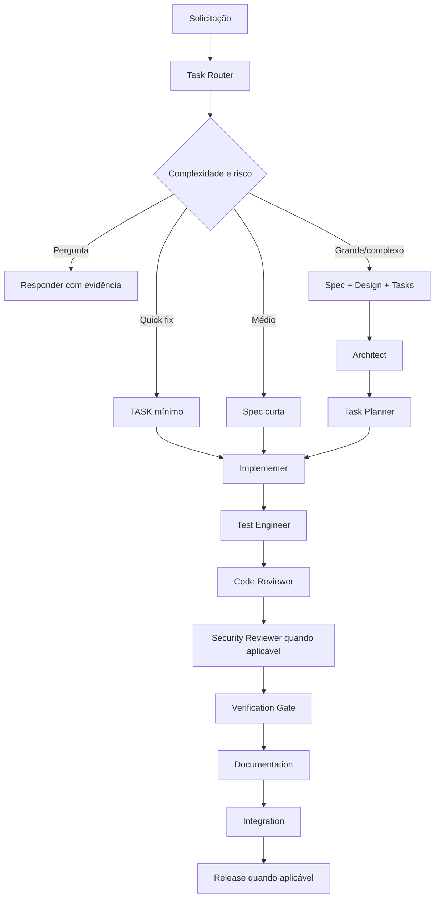

# Fluxo agêntico recomendado

## Princípio

O agente deve usar o menor fluxo capaz de produzir uma mudança segura, verificável e rastreável.

## Gates

### Gate 0 — Estado
`git status --short` + `git diff`.

### Gate 1 — Intenção
Requisito e critério de aceitação identificados.

### Gate 2 — Design
Necessário somente quando risco/complexidade exigir.

### Gate 3 — Implementação
Mudança mínima e rastreável.

### Gate 4 — Evidência
Build + testes + validações aplicáveis.

### Gate 5 — Encerramento
Documentação, rastreabilidade, estado e riscos atualizados.
